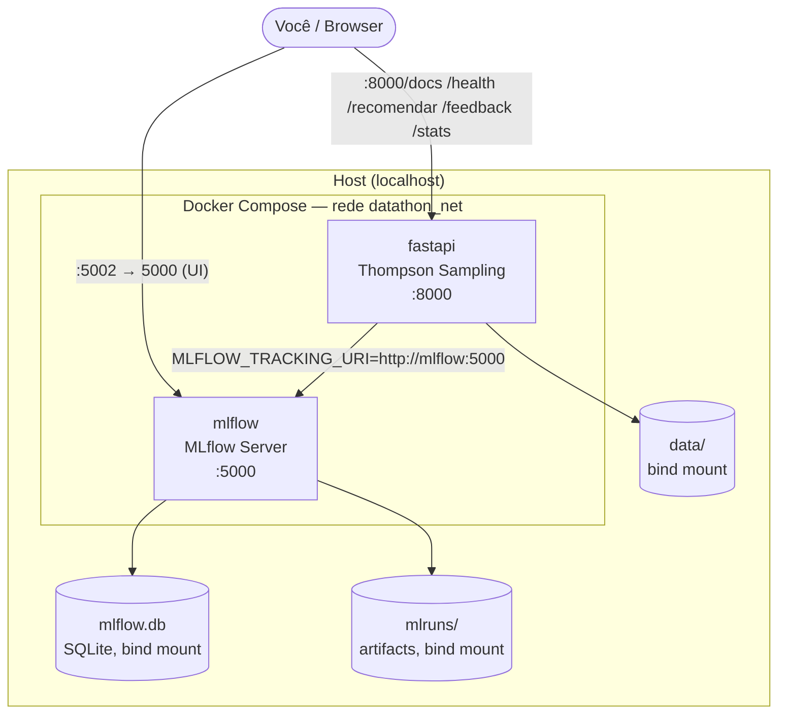
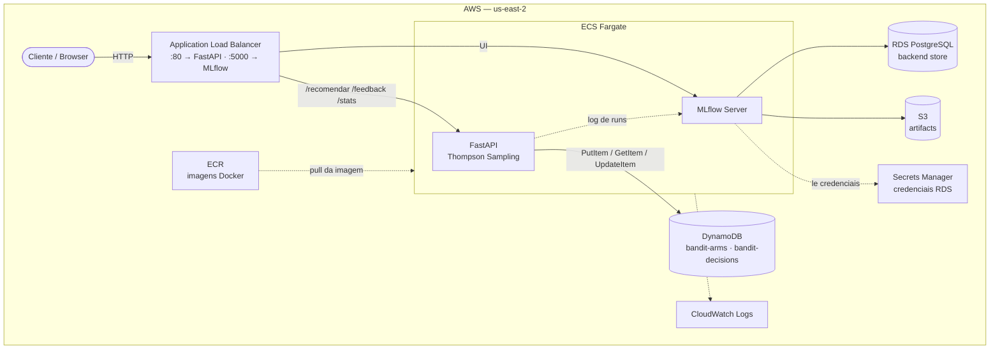

|     -FF9900?logo=amazonaws)  |
|:----------------------------------------------------------------------------------------------------------------------------------------:|

# 🎯 Datathon — Plataforma de Experimentação Adaptativa para Ofertas Financeiras

## 📌 Descrição

Solução completa **end-to-end** para personalização adaptativa de canal de contato usando **Thompson Sampling** (Multi-Armed Bandit, via [MABWiser](https://github.com/fidelity/mabwiser)). Serviço que aprende continuamente qual canal (celular/telefone) cada cliente prefere, otimizando taxas de conversão em tempo real — com baseline determinístico, tracking em MLflow e deploy real na AWS via Terraform.

---

## 🚀 Status Atual — 9 de 9 Etapas completas

| Etapa | Objetivo | Status |
|------|----------|--------|
| **0** | Organização do Projeto | ✅ Completa |
| **1** | Base Kaggle e EDA | ✅ Completa |
| **2** | Preparação da Base | ✅ Completa |
| **3** | Baseline + Thompson Sampling | ✅ Completa (supera o baseline: +30,95% de conversão relativa) |
| **4** | Avaliação e Golden Set | ✅ Completa |
| **5** | Serviço/API (FastAPI) | ✅ Completa |
| **6** | Arquitetura-Alvo em Nuvem | ✅ Completa — **implantada na AWS** (documentada) |
| **7** | Ciclo de Vida MLOps (MLflow) | ✅ Completa — validada rodando|
| **8** | Demo Day / Vídeo Pitch | ✅ Completa — [vídeo de apresentação](https://drive.google.com/file/d/1TH3DYvizt4EK0DsREHkX-L_sfjcHJhtP/view?usp=sharing) |


---

## 📊 Base de Dados

O projeto usa uma única base Kaggle do início ao fim (EDA, baseline, bandit e API):

| Base | Autor | Uso |
|------|-------|-----|
| **Bank Term Deposit Subscription** (`bank-full.csv`) | [dharmik34](https://www.kaggle.com/datasets/dharmik34/bank-term-deposit-subscription) | EDA (Etapa 1) até a API em produção (Etapa 5) — coluna `contact` como braço do bandit (`cellular`/`telephone`) |

**Leakage:** `duration` é removida por ser conhecida somente após a ligação. `pdays`, `previous` e `poutcome` são mantidas como histórico anterior ao contato.

---

## 🚀 Quick Start

### 1️⃣ Setup 

```bash
# Ambiente virtual
python3 -m venv venv
source venv/bin/activate

# Instalar dependências
pip install -r requirements.txt
```

### 2️⃣ Configurar Kaggle 

```bash
# 1. Gerar token em: https://www.kaggle.com/settings/account
# 2. Baixar arquivo kaggle.json
# 3. Configurar:

mkdir -p ~/.kaggle
cp ~/Downloads/kaggle.json ~/.kaggle/
chmod 600 ~/.kaggle/kaggle.json

# 4. Testar
kaggle datasets list | head -5
```

**Guia detalhado:** `.kaggle/KAGGLE_SETUP.md`

### 3️⃣ Rodar os notebooks (EDA → Baseline → Avaliação)

```bash
jupyter notebook notebooks/01_EDA.ipynb                 # Etapa 1: EDA (bank-term-deposit-subscription)
jupyter notebook notebooks/02_Preparacao_da_Base.ipynb  # Etapa 2: features + target
jupyter notebook notebooks/03_Baseline_e_Thompson.ipynb # Etapa 3: baseline vs. Thompson Sampling + tracking MLflow
jupyter notebook notebooks/04_Avaliacao_e_Golden_Set.ipynb # Etapa 4: métricas + Golden Set
```

**Resultado:** `data/processed/bank-term-deposit-subscription_eda/` (features, `arm_stats.csv` usado como warm start pela API) ✅

---

# 🖥️ Como usar a API (Etapa 5)

O serviço (`app/`) é o mesmo em ambos os casos — só muda onde ele está rodando.

### 📡 Endpoints da API

GET /health → Status da API.

POST /recomendar → Recomenda o canal de contato (cellular/telephone) para um cliente e registra a decisão.

POST /feedback → Registra o resultado real (conversão ou não) de uma recomendação e atualiza o bandit.

GET /stats → Estado atual do bandit (crença por braço) — observabilidade do aprendizado.

GET /docs → Documentação interativa (Swagger), gerada automaticamente pelo FastAPI.

### Opção 1 — Local via Docker Compose (desenvolvimento)

```bash
git clone <repo-url> datathon-8mlet-grupo-04
cd datathon-8mlet-grupo-04

docker compose -f deploy/docker-compose.yml build
docker compose -f deploy/docker-compose.yml up -d --force-recreate

# Status e logs
docker compose -f deploy/docker-compose.yml ps
docker compose -f deploy/docker-compose.yml logs -f --tail=200
```

**Endpoints locais:**

| Serviço | URL |
|---|---|
| API FastAPI (docs) | http://localhost:8000/docs |
| API FastAPI (health) | http://localhost:8000/health |
| MLflow UI | http://localhost:5002/ |

> O compose mapeia a porta do container do MLflow (5000) para `5002` no host, para não colidir se você já tiver algo rodando na 5000.

**Arquitetura local (Docker Compose):**



Diferença-chave pra AWS: aqui o backend store é o `mlflow.db` (SQLite) e os artifacts vão pro `mlruns/` local, ambos montados como volume no container do MLflow — sem RDS/S3, só funciona com uma réplica de cada serviço (ver [deploy/docker-compose.yml](deploy/docker-compose.yml)).

Alternativa mais leve, sem Docker (só o MLflow, rodando na porta 5000 nesse caso):
```bash
mlflow server --backend-store-uri sqlite:///mlflow.db --default-artifact-root ./mlruns --host 0.0.0.0 --port 5000
```

Persistência e migração do MLflow (SQLite):
```bash
docker compose -f deploy/docker-compose.yml exec -T mlflow mlflow db upgrade sqlite:///mlflow.db
cp deploy/mlflow.db deploy/mlflow.db.bak && tar -czf deploy/mlruns-backup.tar.gz deploy/mlruns
```

Mais detalhes operacionais em [deploy/README.md](deploy/README.md).

### Opção 2 — AWS (implantado via Terraform)

O mesmo serviço também está implantado de verdade na AWS (região `us-east-2`): ECS Fargate + Application Load Balancer, com o bandit persistido em DynamoDB (em vez do arquivo local) e o MLflow com backend em RDS PostgreSQL + artifacts em S3.

**Endpoints AWS:**

| Serviço | URL |
|---|---|
| API FastAPI (docs) | http://datathon-bandit-alb-361652049.us-east-2.elb.amazonaws.com/docs |
| API FastAPI (health) | http://datathon-bandit-alb-361652049.us-east-2.elb.amazonaws.com/health |
| MLflow UI | http://datathon-bandit-alb-361652049.us-east-2.elb.amazonaws.com:5000/ |

> ℹ️ **Estado atual: stack sempre ativo** (`desired_count=1` fixo no Terraform para os dois serviços) — os endpoints acima respondem 24/7, sem precisar retomar nada. Se em algum momento o stack for pausado manualmente fora do Terraform (`desired_count=0`, para não gerar custo enquanto ninguém usa), os endpoints voltam a responder 503/403 até serem retomados com:
> ```bash
> export AWS_PROFILE=datathon AWS_REGION=us-east-2
> aws ecs update-service --cluster datathon-bandit-cluster --service datathon-bandit-fastapi --desired-count 1
> aws ecs update-service --cluster datathon-bandit-cluster --service datathon-bandit-mlflow  --desired-count 1
> ```
> Leva ~1-2 min para os endpoints responderem. Sem HTTPS e sem autenticação (aceitável para um ambiente de demo de curta duração, ver notas de segurança no runbook).
>
> ⚠️ A UI do MLflow só funciona nesse endpoint porque `MLFLOW_SERVER_CORS_ALLOWED_ORIGINS` está setado pro DNS do ALB no task definition ([deploy/aws/terraform/ecs.tf](deploy/aws/terraform/ecs.tf)) — MLflow ≥3.16 bloqueia por padrão (403/`INTERNAL_ERROR` na UI) chamadas de origem não-localhost sem essa allowlist. Se o DNS do ALB mudar (ex.: recriação do load balancer), essa env var precisa ser atualizada junto.

Runbook completo (criar o usuário IAM, deploy do zero, verificação, pausar, destruir, custo estimado) em [deploy/aws/README.md](deploy/aws/README.md).

---

## 🎥 Vídeo de Apresentação (Etapa 8)

Roteiro de até 5 min mostrando o problema, o modelo (baseline vs. Thompson Sampling) e a Etapa 5 — API — rodando na prática, local e na AWS.

[Acesse aqui](https://drive.google.com/file/d/1TH3DYvizt4EK0DsREHkX-L_sfjcHJhtP/view?usp=sharing)

---

## ☁️ Arquitetura-Alvo em Nuvem (AWS) — por que essas escolhas



Partindo das imagens já existentes em `deploy/` (`Dockerfile.fastapi`, `Dockerfile.mlflow`), o caminho mais direto para colocar este projeto no ar na AWS é publicá-las no **Amazon ECR** e rodá-las como serviços no **Amazon ECS com Fargate** (containers gerenciados, sem servidor para administrar), com um **Application Load Balancer** expondo tanto a API FastAPI (porta 80) quanto a UI do MLflow (porta 5000) publicamente — a segunda sem autenticação, uma simplificação aceitável para um ambiente de demo de curta duração, não para produção real. Os dados brutos e processados do Kaggle (hoje em `data/`) iriam para um bucket **S3**, e o pipeline de EDA/treino dos notebooks poderia rodar como tarefa agendada no próprio ECS, sem alterar o código.

O ponto que mais muda em relação ao ambiente local é o estado: hoje o bandit persiste em um arquivo pickle (`data/bandit_state.pkl`) e o MLflow usa SQLite local — o que só funciona com uma única réplica, como já registrado nas limitações do [app/README.md](app/README.md). Na AWS, tanto os contadores do bandit quanto o log de decisões migrariam para o **DynamoDB**: o padrão de acesso real (grava decisão pendente, depois busca por `decision_id` e atualiza com o resultado) é get/update por chave primária, que o DynamoDB atende nativamente via `PutItem`/`GetItem`/`UpdateItem` — diferente de um object store como o S3, que fica reservado para os artifacts do MLflow. O MLflow passaria a usar **RDS PostgreSQL** como backend store e **S3** como artifact store, permitindo escalar a API horizontalmente sem perder consistência. Observabilidade (logs, métricas e alarmes de erro/latência) ficaria centralizada no **CloudWatch**, e credenciais sensíveis (ex.: senha do RDS) no **Secrets Manager**.

**Implementação real:** o Terraform completo dessa arquitetura (ECR, ECS Fargate, ALB, DynamoDB, RDS, S3, CloudWatch, Secrets Manager, IAM) vive em [deploy/aws/](deploy/aws/).

---

## 📁 Estrutura do Projeto

```
datathon-8mlet-grupo-04/
│
├── 📓 notebooks/
│   ├── 01_EDA.ipynb                    ← Etapa 1: EDA (bank-term-deposit-subscription)
│   ├── 02_Preparacao_da_Base.ipynb     ← Etapa 2: features + target
│   ├── 03_Baseline_e_Thompson.ipynb    ← Etapa 3: baseline vs. Thompson Sampling + tracking MLflow (Etapa 7)
│   ├── 04_Avaliacao_e_Golden_Set.ipynb ← Etapa 4: métricas + Golden Set
│   ├── 06_Arquitetura_Cloud.ipynb      ← Etapa 6: decisão AWS (resumo; detalhe em deploy/aws/)
│   └── analise das bases.ipynb         ← rascunho exploratório (fora do fluxo numerado 01-06)
│
├── 🐍 src/
│   ├── __init__.py
│   └── data_processing.py              ← Funções reutilizáveis de EDA/pipeline
│
├── 🚀 app/                             ← Etapa 5: serviço FastAPI (Thompson Sampling em produção)
│   ├── main.py                         ← Endpoints: /, /health, /recomendar, /feedback, /stats
│   ├── bandit_store.py                 ← Persistência do bandit (backend "file" local ou "dynamodb" na AWS)
│   ├── mlflow_config.py                ← Config centralizada MLflow (detecta local vs. AWS)
│   ├── mlflow_utils.py                 ← Funções reusáveis de tracking (Etapa 7)
│   ├── schemas.py
│   ├── demo_client.py                  ← Script de exemplo consumindo a API (local)
│   ├── demo_client_aws.py              ← Idem, apontando pro endpoint AWS
│   ├── requirements.txt
│   └── README.md                       ← Documentação do serviço
│
├── 🐳 deploy/                          ← Deploy local (Docker Compose) e AWS (Terraform)
│   ├── Dockerfile.fastapi / Dockerfile.mlflow
│   ├── mlflow-entrypoint.sh
│   ├── docker-compose.yml              ← MLflow + FastAPI buildados a partir dos Dockerfiles acima
│   ├── docker-compose-rds.yml          ← Variante local apontando pro RDS/S3 da AWS
│   ├── docker-compose-fix.yml          ← Variante alternativa (imagem oficial do MLflow)
│   ├── migrate-mlflow-to-rds.sh / sync-mlflow.sh / sync-and-reset.sh / validate-mlflow-local.sh
│   ├── scripts/                        ← control.sh, docker-control.sh, ecs-control.sh
│   ├── README.md                       ← Deploy local
│   ├── STATUS.md
│   └── aws/                            ← Etapa 6: Terraform + IAM + runbook AWS
│       ├── terraform/                  ← ECR, ECS Fargate, ALB, DynamoDB, RDS, S3, CloudWatch, Secrets Manager
│       ├── iam/deploy-user-policy.json ← Política IAM do usuário de deploy
│       ├── manage-ecs.sh / push_images.sh / seed_bandit_arms.py
│       ├── OPERATIONS.md
│       └── README.md                   ← Runbook: deploy, verificação, pausa, teardown, custo
│
├── 📊 data/                            ← Dados brutos/processados e estado do bandit (não versiona)
│   └── processed/bank-term-deposit-subscription_eda/
│
├── 📚 doc/
│   ├── datathon.md                     ← Briefing oficial do datathon
│   ├── PLANO_EXECUCAO.md               ← Status detalhado de cada etapa (fonte da verdade do progresso)
│   └── POSTECH - MLET - DATATHON.pdf   ← Enunciado oficial (PDF)
│
├── 🔑 .kaggle/
│   └── KAGGLE_SETUP.md                 ← Como configurar token Kaggle
│
├── 📋 README.md                        ← Este arquivo
├── 📦 requirements.txt                 ← Dependências Python (notebooks)
├── mlflow.db                           ← Banco SQLite do MLflow local (versionado apesar do .gitignore genérico p/ *.db)
├── .env.example                        ← Template de variáveis de ambiente
├── .python-version                     ← 3.12
└── .gitignore
```


---

## 🎓 Fluxo de Trabalho

```
1. Setup Kaggle
   ↓
2. Notebook 01_EDA.ipynb            → EDA + tratamento (bank-term-deposit-subscription)
   ↓
3. Notebook 02_Preparacao_da_Base.ipynb → features + target prontos
   ↓
4. Notebook 03_Baseline_e_Thompson.ipynb
   ├─ Baseline determinístico (regra fixa)
   ├─ Thompson Sampling (MABWiser) superando o baseline
   └─ Tracking no MLflow (Etapa 7)
   ↓
5. Notebook 04_Avaliacao_e_Golden_Set.ipynb → métricas + 5 casos de teste
   ↓
6. app/ (FastAPI) → serviço real, consome o mesmo warm start (arm_stats.csv)
   ├─ Local: docker compose (deploy/docker-compose.yml)
   └─ AWS: Terraform (deploy/aws/) — ECS Fargate + ALB + DynamoDB + RDS
   ↓
7. Notebook 06_Arquitetura_Cloud.ipynb → decisão AWS (resumo)
   ↓
8. Vídeo de Apresentação (Demo Day) → link acima
```

---

## 🔧 Tecnologias

| Componente | Tecnologia |
|-----------|------------|
| Linguagem | Python 3.12+ |
| Data Science | Pandas, NumPy |
| Bandit | MABWiser (Thompson Sampling) |
| Visualização | Matplotlib, Seaborn |
| Notebooks | Jupyter |
| API | FastAPI + Uvicorn |
| MLOps | MLflow |
| Deploy local | Docker / Docker Compose |
| Deploy AWS | Terraform · ECR · ECS Fargate · ALB · DynamoDB · RDS PostgreSQL · S3 · CloudWatch · Secrets Manager |
| AWS SDK | boto3 |

---

## 📊 O que este projeto cobre (Etapas 1-8)

✅ **Exploração de Dados (EDA)** — distribuição de variáveis, correlações, missings/outliers

✅ **CRÍTICO: Vazamento Temporal** — `duration` removida (só é conhecida após a ligação); impacto em produção documentado

✅ **Preparação de Dados** — tratamento de missings, encoding, normalização

✅ **Baseline vs. Adaptativo** — regra fixa vs. Thompson Sampling, com ganho mensurado (+30,95% de conversão relativa)

✅ **Avaliação** — métricas do modelo + Golden Set com casos de teste

---

## 📝 Dados Excluídos do Git

Pelo `.gitignore`:
```
❌ data/                    (Dados brutos, processados e estado do bandit)
❌ .env                     (Variáveis de ambiente)
❌ .kaggle/kaggle.json      (Credenciais Kaggle)
❌ *.log, mlruns/           (Logs e experimentos locais do MLflow)
❌ deploy/aws/terraform/*.tfstate*, .terraform/  (Estado do Terraform — contém a senha do RDS)
```

---


---

## 🤝 Contribuindo

1. Clone o repositório
2. Configure Kaggle (`.kaggle/KAGGLE_SETUP.md`)
3. Rode os notebooks (Etapas 1-4) ou suba a API via Docker Compose / AWS
4. Commit + Push

---

## 📖 Documentação Completa

- **Setup Kaggle:** `.kaggle/KAGGLE_SETUP.md`
- **Briefing oficial do datathon:** [doc/datathon.md](doc/datathon.md)
- **Serviço FastAPI:** [app/README.md](app/README.md)
- **Deploy local (Docker Compose):** [deploy/README.md](deploy/README.md)
- **Deploy AWS (Terraform):** [deploy/aws/README.md](deploy/aws/README.md)

---

## 📞 Status

- **Repositório:** `datathon-8mlet-grupo-04`
- **Status:** 9/9 Etapas completas
- **Última atualização:** 2026-09-28

---

