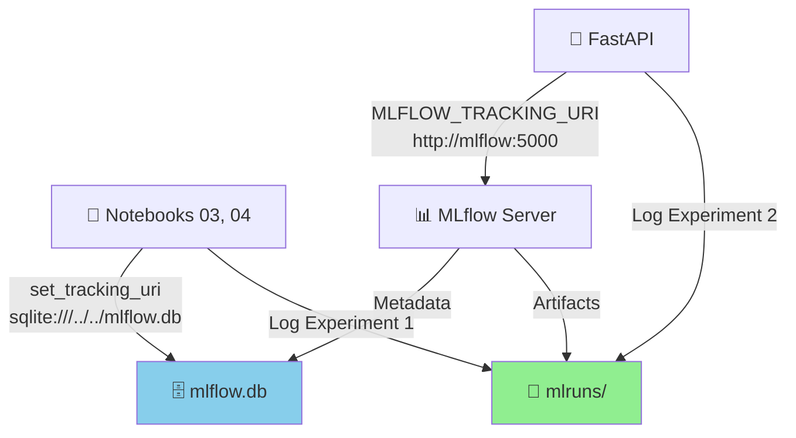
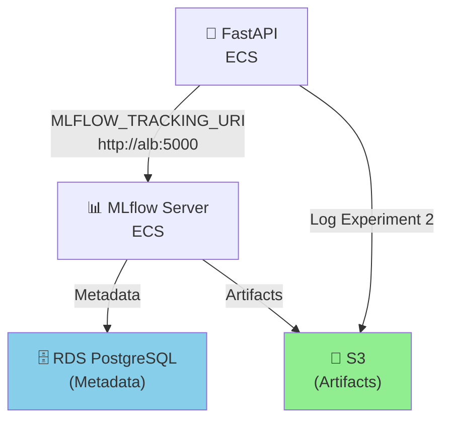

# 🔗 MLflow - Unificação de Experiments

## 📋 O que foi corrigido

O projeto tinha **duas pastas `mlruns` separadas**, criando fragmentação no histórico do MLflow:

### ❌ Antes (Problema)

```
projeto/
├── mlruns/                         ◄─── Experiment 2 (API em produção)
│   └── 2/
├── notebooks/mlruns/               ◄─── Experiment 1 (Notebooks de treinamento) [REDUNDANTE]
│   └── 1/
└── mlflow.db                        ◄─── Backend local (de qual?)
```

**Consequências:**
- ❌ MLflow não via o histórico completo (Experiments 1 e 2 separados)
- ❌ Docker Compose usava pasta da raiz, notebooks usavam pasta local
- ❌ Impossível rastrear evolução do modelo (treinamento → produção)

### ✅ Depois (Corrigido)

```
projeto/
├── mlruns/                         ◄─── Todos os experiments em um único lugar
│   ├── 1/                          ◄─── Experiment 1: Treinamento (notebooks 03, 04)
│   └── 2/                          ◄─── Experiment 2: Produção (API)
├── mlflow.db                        ◄─── Backend único (compartilhado)
└── notebooks/                       ◄─── Sem pasta mlruns local
```

**Benefícios:**
- ✅ Um único MLflow tracking para toda a pipeline
- ✅ Histórico completo: treinamento → validação → produção
- ✅ Docker Compose, notebooks e AWS acessam o **mesmo** MLflow
- ✅ Rastreabilidade: qual versão do modelo está em produção

---

## 🔧 Mudanças Realizadas

### 1. Consolidação de Dados

```bash
# Backup de segurança criado
mlruns_backup_notebooks/

# Experiment 1 (notebooks) movido para raiz
mlruns/1/

# Estrutura final
mlruns/
├── 1/  ← Treinamento (Etapas 3 e 4)
└── 2/  ← Produção (API em tempo real)
```

### 2. Atualização dos Notebooks

#### **Notebook 03 - Baseline e Thompson Sampling**

**Antes:**
```python
mlflow.set_tracking_uri('sqlite:///../mlflow.db')
```

**Depois:**
```python
mlflow.set_tracking_uri('sqlite:///../../mlflow.db')  # sobe 2 níveis até raiz
```

#### **Notebook 04 - Avaliação e Golden Set**

**Antes:**
```python
mlflow.set_tracking_uri('sqlite:///../mlflow.db')
```

**Depois:**
```python
mlflow.set_tracking_uri('sqlite:///../../mlflow.db')  # sobe 2 níveis até raiz
```

---

## 🔄 Arquitetura Agora

### Local (Desenvolvimento)



**Fluxo:**
1. Notebooks rodam → Log em `mlruns/1/` + `mlflow.db`
2. Docker Compose inicia → MLflow lê `mlruns/` + `mlflow.db`
3. FastAPI se conecta → Log em `mlruns/2/` (Experiment 2)
4. **Mesmo MLflow vê todo o histórico**

### AWS (Produção)



**Equivalência:**
- `mlflow.db` (local) ↔ RDS PostgreSQL (AWS)
- `mlruns/` (local) ↔ S3 (AWS)
- Mesmos experiments em ambos (Exp 1, 2)

---

## 📊 Estrutura de Experiments

Ambos os ambientes (local e AWS) veem a mesma estrutura:

### Experiment 1: `datathon-bandit-canal` (Treinamento)

| Run | Notebook | Artefatos | Métricas |
|-----|----------|-----------|----------|
| `70fce3e...` | 03_Baseline | baseline_results.csv | baseline_conversion, thompson_conversion |
| `685d3f34...` | 04_Avaliacao | golden_set_results.csv | lift, IC95%, regret_acumulado |
| ... | ... | ... | ... |

**Armazenados em:**
- Local: `mlruns/1/`
- AWS: `s3://bucket/mlflow-artifacts/1/`

### Experiment 2: `datathon-bandit-app` (Produção)

| Run | Endpoint | Artefatos | Tags |
|-----|----------|-----------|------|
| `uuid-1` | POST /recomendar | client_context.json | decision_id, arm, selected |
| `uuid-2` | POST /feedback | — | decision_id, reward_observed |
| ... | ... | ... | ... |

**Armazenados em:**
- Local: `mlruns/2/`
- AWS: `s3://bucket/mlflow-artifacts/2/`

---

## 🚀 Como Usar Agora

### Local (Docker Compose)

```bash
# 1. Notebooks ANTES do Docker Compose
jupyter notebook notebooks/03_Baseline_e_Thompson.ipynb
jupyter notebook notebooks/04_Avaliacao_e_Golden_Set.ipynb
# → Logs vão para mlruns/1/

# 2. Docker Compose para visualizar + usar a API
docker compose -f deploy/docker-compose.yml up

# 3. MLflow UI (porta 5002)
# → http://localhost:5002
# → Vê Experiments 1 (notebooks) + 2 (API)
```

### AWS (Produção)

```bash
# Deploy
cd deploy/aws/terraform
terraform apply

# MLflow UI (via ALB)
# → http://<alb-dns>:5000
# → Vê Experiments 1 (histórico) + 2 (rodadas atuais)
```

---

## ✅ Checklist de Verificação

- [x] Pasta `notebooks/mlruns/` removida
- [x] Experiment 1 consolidado em `mlruns/1/`
- [x] Notebook 03 apontando para `sqlite:///../../mlflow.db`
- [x] Notebook 04 apontando para `sqlite:///../../mlflow.db`
- [x] Docker Compose continua usando `../mlruns` (correto)
- [x] AWS Terraform continua usando S3 + RDS (correto)

---

## 🔗 Rastreabilidade Completa

Agora é possível:

1. **Ver a evolução do modelo:**
   ```
   Experiment 1 (Etapas 3-4): Treinamento + Validação
   ↓
   Experiment 2 (Etapa 5): Deploy em produção
   ↓
   MLflow tracks decisões em tempo real
   ↓
   Bandit aprende com feedback observado
   ```

2. **Comparar versões:**
   - Qual baseline foi usado?
   - Qual lift alcançou em teste?
   - Qual performance em produção?

3. **Auditar decisões:**
   - Cada recomendação está logada (decision_id, arm, client_context)
   - Cada feedback observado está registrado
   - Histórico completo por cliente

---

## 📝 Próximos Passos

1. **Rodar notebooks** com a nova configuração:
   ```bash
   jupyter notebook notebooks/03_Baseline_e_Thompson.ipynb
   jupyter notebook notebooks/04_Avaliacao_e_Golden_Set.ipynb
   ```

2. **Iniciar Docker Compose** e validar:
   ```bash
   docker compose -f deploy/docker-compose.yml up
   curl http://localhost:8000/health
   curl http://localhost:5002  # MLflow UI
   ```

3. **Confirmar que ambos experiments aparecem** na UI do MLflow

---

**Status:** ✅ Unificação completa do MLflow  
**Documento:** 2026-09-19

