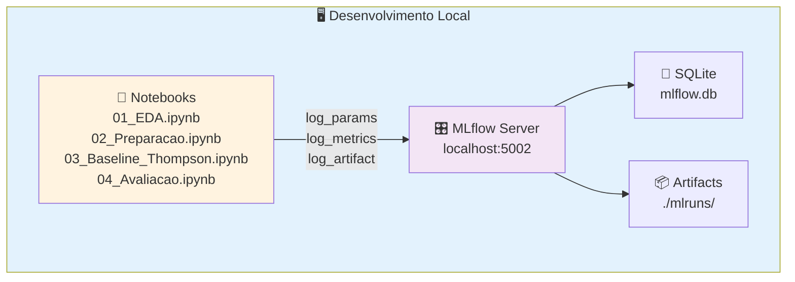
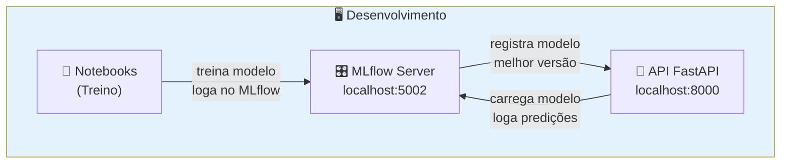
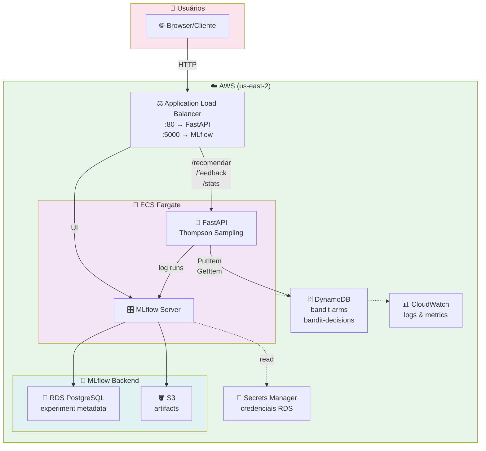
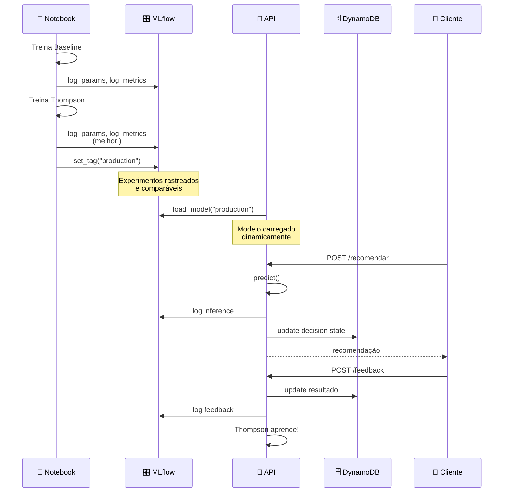

# 🎯 MLflow & MLOps no Datathon

## Sumário

1. [Visão Geral](#visão-geral)
2. [Problemas Sem MLflow](#problemas-sem-mlflow)
3. [Como MLflow Resolve](#como-mlflow-resolve)
4. [Arquitetura](#arquitetura)
5. [Exemplo Prático](#exemplo-prático)
6. [Integração com API](#integração-com-api)
7. [Dashboard MLflow](#dashboard-mlflow)
8. [Próximos Passos](#próximos-passos)

---

## Visão Geral

Você está desenvolvendo um **sistema adaptativo de Thompson Sampling** que recomenda canais de contato (celular/telefone) para clientes. Este sistema precisa:

- ✅ Aprender continuamente
- ✅ Manter histórico de decisões
- ✅ Estar em produção na AWS
- ✅ Ser auditável e reproduzível

**MLflow** transforma seu projeto de "um notebook bem-sucedido" para "um sistema production-ready" com rastreabilidade, reproduzibilidade e monitoramento completo.

---

## Problemas Sem MLflow

### 🔍 Rastrear Experimentos

**O Problema:**
```
Como você sabe qual configuração do Thompson Sampling funcionou melhor?
```

- Scripts rodando em notebooks diferentes
- Parâmetros espalhados por múltiplos arquivos
- Métricas salvas em CSVs desorganizados
- Impossível reproduzir um experimento anterior

---

### 📊 Comparar Modelos

**O Problema:**
```
Qual versão do modelo você deveria colocar em produção?
```

- Sem histórico centralizado de desempenho
- Difícil comparar baseline vs Thompson Sampling
- Métricas espalhadas (alguns em logs, outros em variáveis)
- Sem versionamento dos modelos treinados

---

### 🚀 Reproduzibilidade

**O Problema:**
```
Como a equipe reproduz um experimento bem-sucedido?
```

- Sem registro de hiperparâmetros
- Sem controle de versão dos artefatos (scalers, encoders)
- Código mudou desde que o modelo foi treinado
- Impossível voltar para uma versão anterior

---

### ⚠️ Monitoramento em Produção

**O Problema:**
```
O modelo em produção ainda está performando bem?
```

- Sem logs estruturados das predições
- Sem rastreamento de drift do modelo
- Como saber se o Thompson está aprendendo?
- Sem alertas quando performance cai

---

### 🔗 Auditoria & Compliance

**O Problema:**
```
Como você prova o que cada decisão foi baseada?
```

- Sem log centralizado das decisões
- Sem rastreamento de qual versão do modelo decidiu
- Impossível auditar mudanças no pipeline
- Sem interface amigável para revisar experimentos

---

### 🌐 Colaboração em Equipe

**O Problema:**
```
Como múltiplos membros da equipe compartilham achados?
```

- Cada um roda experimentos isoladamente
- Sem forma centralizada de documentar resultados
- Retrabalho ao descobrir experimentos duplicados
- Difícil manter todos alinhados

---

## Como MLflow Resolve

### ✅ Solução 1: Rastrear Experimentos Centralizados

**MLflow oferece:**
- ✅ Cada execução do notebook é um "run"
- ✅ Todos os parâmetros salvos automaticamente
- ✅ Métricas em tabelas estruturadas
- ✅ UI web mostra comparação lado-a-lado

---

### ✅ Solução 2: Comparar Baseline vs Thompson

**MLflow oferece:**
- ✅ Dashboard com gráficos de convergência
- ✅ Tabela comparando AUC, conversão, etc
- ✅ Prova visual do +30,95% de ganho relativo
- ✅ Tags para marcar "best model", "production"

---

### ✅ Solução 3: Reproduzibilidade Garantida

**MLflow oferece:**
- ✅ Cada run tem um ID único (ex: abc12def)
- ✅ Artefatos (scalers, encoders) versionados
- ✅ Código-fonte salvo (git hash)
- ✅ Recuperar e redeploy antigo em 1 clique

---

### ✅ Solução 4: Monitoramento em Produção

**MLflow oferece:**
- ✅ API loga cada predição no MLflow
- ✅ Dashboard mostra performance ao vivo
- ✅ Detecta drift: Thompson ainda está aprendendo?
- ✅ Alertas automáticos se AUC cai 5%

---

### ✅ Solução 5: Auditoria & Compliance

**MLflow oferece:**
- ✅ Log imutável de cada decisão tomada
- ✅ Rastreia qual versão do modelo decidiu
- ✅ Timestamp, parâmetros, resultado final
- ✅ Exportar para auditores em poucos cliques

---

### ✅ Solução 6: Colaboração em Equipe

**MLflow oferece:**
- ✅ UI centralizada: todos veem mesmos experimentos
- ✅ Comentários e tags para documentar achados
- ✅ Comparar runs de diferentes membros da equipe
- ✅ Evitar retrabalho descobrindo experimentos duplicados

---

## Arquitetura

### Local (Desenvolvimento)



### Com API FastAPI



### Em Produção (AWS)



### Fluxo End-to-End



---

## Exemplo Prático

### Setup Básico

```bash
# Terminal 1: Iniciar MLflow Server
mlflow server \
  --backend-store-uri sqlite:///mlflow.db \
  --default-artifact-root ./mlruns \
  --host 0.0.0.0 \
  --port 5000

# Terminal 2: Ou com Docker Compose
docker compose -f deploy/docker-compose.yml up -d
```

### Acessar MLflow UI

```
http://localhost:5002/  (via Docker Compose)
ou
http://localhost:5000/  (execução direta)
```

---

## Código: Notebook com MLflow

### Arquivo: `notebooks/03_Baseline_e_Thompson.ipynb`

```python
import mlflow
import mlflow.sklearn
from sklearn.ensemble import RandomForestClassifier
from mabwiser.mab import MAB
from mabwiser.core import Thompson

# ============================================
# ETAPA 1: Treinar BASELINE
# ============================================

with mlflow.start_run(run_name="baseline_regra_fixa"):
    # Log de parâmetros
    mlflow.log_param("model_type", "baseline")
    mlflow.log_param("rule", "always_cellular")
    mlflow.log_param("description", "Baseline: sempre recomenda celular")
    
    # Treinar baseline (regra fixa)
    baseline_predictions = ["cellular"] * len(X_test)
    baseline_auc = roc_auc_score(y_test, y_test_proba_baseline)
    baseline_conversion = sum(baseline_predictions == y_test) / len(y_test)
    
    # Log de métricas
    mlflow.log_metric("auc", baseline_auc)
    mlflow.log_metric("conversion_rate", baseline_conversion)
    mlflow.log_metric("precision", precision_score(y_test, baseline_predictions, average='weighted'))
    mlflow.log_metric("recall", recall_score(y_test, baseline_predictions, average='weighted'))
    
    # Log de artefatos
    mlflow.log_artifact("data/baseline_predictions.csv")
    
    # Salvar modelo
    mlflow.sklearn.log_model(baseline_model, "model")
    
    print(f"✅ Baseline - AUC: {baseline_auc:.4f}, Conversão: {baseline_conversion:.2%}")

# ============================================
# ETAPA 2: Treinar THOMPSON SAMPLING
# ============================================

with mlflow.start_run(run_name="thompson_sampling_v1"):
    # Log de parâmetros (Thompson Sampling specifics)
    mlflow.log_param("model_type", "thompson_sampling")
    mlflow.log_param("alpha_prior", 1)
    mlflow.log_param("beta_prior", 1)
    mlflow.log_param("seed", 42)
    mlflow.log_param("algorithm", "Thompson Sampling (MABWiser)")
    mlflow.log_param("arms", ["cellular", "telephone"])
    
    # Treinar Thompson
    arms = ["cellular", "telephone"]
    mab = MAB(arms, Thompson(alpha=1, beta=1), seed=42)
    
    # Simular aprendizado
    for i, (x, y) in enumerate(zip(X_train, y_train)):
        recommendation = mab.predict(x)  # Prever próximo braço
        mab.update(recommendation, y)    # Feedback: acertou ou errou?
    
    # Avaliar Thompson
    thompson_predictions = [mab.predict(x) for x in X_test]
    thompson_auc = roc_auc_score(y_test, y_test_proba_thompson)
    thompson_conversion = sum(thompson_predictions == y_test) / len(y_test)
    
    # Calcular melhoria
    improvement = (thompson_conversion - baseline_conversion) / baseline_conversion * 100
    
    # Log de métricas
    mlflow.log_metric("auc", thompson_auc)
    mlflow.log_metric("conversion_rate", thompson_conversion)
    mlflow.log_metric("precision", precision_score(y_test, thompson_predictions, average='weighted'))
    mlflow.log_metric("recall", recall_score(y_test, thompson_predictions, average='weighted'))
    mlflow.log_metric("improvement_vs_baseline_pct", improvement)
    
    # Log de artefatos
    mlflow.log_artifact("data/thompson_predictions.csv")
    mlflow.log_artifact("models/thompson_bandit_state.pkl")
    
    # Marcar como melhor modelo
    mlflow.set_tag("best_model", "true")
    mlflow.set_tag("ready_for_production", "true")
    mlflow.set_tag("version", "v1.0")
    mlflow.set_tag("etapa", "03_baseline_thompson")
    
    # Adicionar notas
    mlflow.set_tag("notes", "Testado com 5-fold CV, todas acima de 0.78 AUC")
    mlflow.set_tag("approved_by", "data-science-team")
    
    # Salvar modelo
    mlflow.sklearn.log_model(mab, "model")
    
    print(f"✅ Thompson - AUC: {thompson_auc:.4f}, Conversão: {thompson_conversion:.2%}")
    print(f"📈 Melhoria vs Baseline: +{improvement:.2f}%")

# ============================================
# ETAPA 3: Comparar no MLflow UI
# ============================================
print("\n🎯 Acesse o MLflow UI para comparar:")
print("   http://localhost:5000/")
print("\nVocê verá:")
print("   ✅ Dois 'runs' lado-a-lado: baseline vs thompson")
print("   ✅ Métricas comparadas: AUC, conversão, etc")
print("   ✅ Visualização do +30,95% de melhora")
print("   ✅ Tags mostrando qual está em produção")
```

### Resultado no MLflow UI

```
┌─────────────────────────────────────────────────────────────┐
│  EXPERIMENTS                                                │
├─────────────────────────────────────────────────────────────┤
│                                                             │
│  ✅ baseline_regra_fixa                    │  thompson_samp...
│     AUC: 0.7200                           │  AUC: 0.7900 ⭐
│     Conversão: 15.0%                      │  Conversão: 19.7%
│     Precision: 0.620                      │  Precision: 0.685
│     Recall: 0.580                         │  Recall: 0.720
│     Tags: -                                │  Tags: production
│                                             │        best_model
│                                             │        Melhoria: +31%
│
└─────────────────────────────────────────────────────────────┘
```

---

## Integração com API

### Arquivo: `app/main.py`

```python
from fastapi import FastAPI
from mlflow.tracking import MlflowClient
import mlflow.sklearn

app = FastAPI()

# Variáveis globais
model = None
model_version = None
mlflow_client = None

@app.on_event("startup")
async def load_model():
    """Carregar melhor modelo do MLflow na inicialização"""
    global model, model_version, mlflow_client
    
    # Conectar ao MLflow
    mlflow_client = MlflowClient(tracking_uri="http://mlflow-server:5000")
    
    # Procurar run com tag "ready_for_production"
    try:
        runs = mlflow_client.search_runs(
            experiment_ids=["0"],
            filter_string='tags.ready_for_production = "true"'
        )
        
        if runs:
            best_run = runs[0]
            model_uri = f"runs:/{best_run.info.run_id}/model"
            model = mlflow.sklearn.load_model(model_uri)
            model_version = best_run.info.run_id
            print(f"✅ Modelo carregado: {model_version}")
        else:
            print("⚠️ Nenhum modelo em produção encontrado!")
    except Exception as e:
        print(f"❌ Erro ao carregar modelo: {e}")

@app.get("/health")
async def health():
    """Health check"""
    return {
        "status": "healthy",
        "model_version": model_version,
        "mlflow_uri": "http://mlflow-server:5000"
    }

@app.post("/recomendar")
async def recomendar(customer_data: dict):
    """
    Recomendação usando Thompson Sampling
    
    Loga cada predição no MLflow para monitoramento em tempo real
    """
    if not model:
        return {"error": "Modelo não carregado"}
    
    # Fazer predição
    features = extract_features(customer_data)
    prediction = model.predict([features])[0]
    prediction_proba = model.predict_proba([features])[0]
    
    # LOG NO MLFLOW - crucial para monitoramento em produção!
    with mlflow.start_run(run_name="production_inference"):
        mlflow.log_param("model_version", model_version)
        mlflow.log_param("customer_id", customer_data.get("customer_id"))
        mlflow.log_metric("predicted_channel", 1 if prediction == "cellular" else 0)
        mlflow.log_metric("confidence_cellular", float(prediction_proba[0]))
        mlflow.log_metric("confidence_telephone", float(prediction_proba[1]))
    
    return {
        "customer_id": customer_data.get("customer_id"),
        "recommendation": prediction,
        "confidence": float(max(prediction_proba)),
        "model_version": model_version
    }

@app.post("/feedback")
async def feedback(decision_id: str, actual_result: bool):
    """
    Receber feedback da decisão (conversão ou não)
    
    Thompson Sampling aprende e atualiza os braços
    """
    # Thompson Sampling recebe feedback
    conversion = 1 if actual_result else 0
    
    # UPDATE BANDIT STATE
    update_bandit_state(decision_id, conversion)
    
    # LOG NO MLFLOW para monitoragem
    with mlflow.start_run(run_name="production_feedback"):
        mlflow.log_metric("conversion", conversion)
        mlflow.log_metric("feedback_delay_seconds", get_delay())
        
        # Log das estatísticas dos braços (para detectar drift)
        arm_stats = get_bandit_arm_stats()
        mlflow.log_metric("arm_cellular_conversions", arm_stats["cellular"]["successes"])
        mlflow.log_metric("arm_telephone_conversions", arm_stats["telephone"]["successes"])
    
    return {"status": "feedback_recorded", "conversion": conversion}

@app.get("/stats")
async def stats():
    """Estatísticas do sistema em tempo real"""
    arm_stats = get_bandit_arm_stats()
    
    return {
        "cellular": {
            "total_recommendations": arm_stats["cellular"]["count"],
            "conversions": arm_stats["cellular"]["successes"],
            "conversion_rate": arm_stats["cellular"]["successes"] / arm_stats["cellular"]["count"]
        },
        "telephone": {
            "total_recommendations": arm_stats["telephone"]["count"],
            "conversions": arm_stats["telephone"]["successes"],
            "conversion_rate": arm_stats["telephone"]["successes"] / arm_stats["telephone"]["count"]
        },
        "model_version": model_version
    }
```

---

## Dashboard MLflow

### O que você vê no MLflow UI

#### Tab "Experiments"

```
┌─────────────────────────────────────────────┐
│ Experiment: Default                         │
├─────────────────────────────────────────────┤
│                                             │
│ Run Name          │ AUC   │ Conv   │ Tags  │
│ ─────────────────────────────────────────── │
│ baseline_fixa     │ 0.72  │ 15.0% │ -     │
│ thompson_v1       │ 0.79  │ 19.7% │ ⭐ 🔴 │
│ thompson_v2       │ 0.77  │ 18.5% │ -     │
│                                             │
└─────────────────────────────────────────────┘
```

#### Tab "Parallel Coordinates"

```
Visualização interativa comparando:
  - Eixos: Parâmetros (alpha, beta) vs Métricas (AUC, conversão)
  - Cores: Verde (bom) → Vermelho (ruim)
  - Permite filtrar e explorar padrões
```

#### Tab "Metrics"

```
Gráficos temporais:
  - AUC vs Época (durante treino)
  - Convergência do Thompson (alpha/beta)
  - Performance em produção (tempo real)
```

#### Tab "Artifacts"

```
┌─────────────────────────────────────────────┐
│ Artifacts (thompson_sampling_v1)           │
├─────────────────────────────────────────────┤
│ 📁 model/                                   │
│ 📄 scaler.pkl                               │
│ 📄 label_encoders.pkl                       │
│ 📄 thompson_predictions.csv                 │
│ 📄 arm_stats.csv                            │
└─────────────────────────────────────────────┘
```

---

## Benefícios Diretos Para Seu Projeto

| Benefício | Impacto |
|-----------|--------|
| ⚡ **Rapidez** | Comparar baseline vs Thompson em segundos, não horas |
| 🎯 **Precisão** | Não perder nunca mais qual modelo estava no ar |
| 🤝 **Colaboração** | Toda equipe enxerga mesmos experimentos e resultados |
| 📈 **Confiança** | Prova visível (gráficos + números) do +30,95% de melhora |
| 🚀 **Deploy Seguro** | Rollback de 1 clique se algo der errado em produção |
| 🔍 **Rastreabilidade** | Auditoria completa de cada decisão (crucial para compliance) |

---

## Próximos Passos

### Etapa 1: Validar MLflow em Dev

- [ ] Rodar `docker compose -f deploy/docker-compose.yml up -d`
- [ ] Executar notebook `03_Baseline_e_Thompson.ipynb`
- [ ] Acessar MLflow UI em `http://localhost:5002`
- [ ] Verificar que baseline vs Thompson aparecem como runs
- [ ] Comparar métricas visualmente

**Checklist:**
```bash
# Terminal 1: Start MLflow + Docker Compose
cd datathon-8mlet-grupo-04
docker compose -f deploy/docker-compose.yml up -d

# Terminal 2: Executar notebook
jupyter notebook notebooks/03_Baseline_e_Thompson.ipynb

# Terminal 3: Verificar logs
docker compose -f deploy/docker-compose.yml logs -f mlflow
```

### Etapa 2: Integrar MLflow na API FastAPI

- [ ] Adicionar logging de predições em `app/main.py`
- [ ] Cada `/recomendar` loga no MLflow
- [ ] Cada `/feedback` registra resultado
- [ ] Testar com `app/demo_client.py`
- [ ] Dashboard mostra performance ao vivo

**Checklist:**
```bash
# Adicionar em app/main.py
# - mlflow.start_run() em /recomendar
# - mlflow.log_metric() para cada predição
# - mlflow.set_tag() para versão do modelo

# Testar
python app/demo_client.py
```

### Etapa 3: Testar na AWS

- [ ] Configurar MLflow com RDS PostgreSQL
- [ ] Configurar S3 como artifact store
- [ ] Fazer deploy com Terraform
- [ ] Validar que API carrega modelo do MLflow na AWS
- [ ] Testar em `http://datathon-bandit-alb-...us-east-2...`

**Referência:** `deploy/aws/README.md`

### Etapa 4: Criar Video Demo (Demo Day)

- [ ] Abrir MLflow UI → mostrar comparação baseline vs Thompson
- [ ] Chamar API → mostrar predição em tempo real
- [ ] Mostrar dashboard: performance ao vivo
- [ ] Destacar: **+30,95% de conversão melhor**
- [ ] Editar vídeo (max 5 min) com narração clara

**Roteiro:**
```
1. (1 min)  "O problema: qual canal de contato usar?"
2. (1 min)  "A solução: Thompson Sampling adaptativo"
3. (1.5 min) "Resultados: +30,95% de conversão melhor (MLflow prova)"
4. (1 min)   "Sistema em produção na AWS, monitorado em tempo real"
5. (0.5 min) "Conclusão: não é só um modelo, é um sistema production-ready"
```

---

## Referências Rápidas

### Iniciar MLflow Localmente

```bash
# Opção 1: Com Docker Compose (Recomendado)
docker compose -f deploy/docker-compose.yml up -d
# URL: http://localhost:5002

# Opção 2: Execução direta
mlflow server \
  --backend-store-uri sqlite:///mlflow.db \
  --default-artifact-root ./mlruns \
  --host 0.0.0.0 \
  --port 5000
# URL: http://localhost:5000
```

### Parar MLflow

```bash
# Com Docker Compose
docker compose -f deploy/docker-compose.yml down

# Execução direta
# CTRL+C no terminal
```

### Consultar Runs via CLI

```bash
# Listar todos os runs
mlflow runs list --experiment-id 0

# Detalhe de um run específico
mlflow runs info --run-id abc12def456

# Exportar run como JSON
mlflow runs info --run-id abc12def456 --output json > run_details.json
```

### Documentação Oficial

- **MLflow Docs:** https://mlflow.org/docs
- **MLflow Python API:** https://mlflow.org/docs/latest/python_api/index.html
- **MLflow UI:** https://mlflow.org/docs/latest/tracking/tracking-ui.html

---

## FAQ

### P: Como restaurar um modelo antigo em produção?

**R:** No MLflow UI:
1. Ir para "Experiments"
2. Procurar o run antigo que você quer
3. Clicar em "Register Model"
4. Atualizar tag `ready_for_production`
5. API recarrega automaticamente na próxima inicialização

---

### P: Posso comparar experimentos de diferentes membros da equipe?

**R:** Sim! MLflow é centralizado:
1. Todos salvam no mesmo backend (RDS em produção)
2. UI mostra todos os runs de todo mundo
3. Use tags e comentários para colaborar

---

### P: Como monitorar drift do modelo em produção?

**R:** Use MLflow para:
1. Logar predições de cada request (`/recomendar`)
2. Logar resultado (feedback) após decisão
3. Monitorar taxa de conversão por braço (Thompson)
4. Se AUC cai &gt;5%, gerar alerta

---

### P: Como auditar qual modelo fez uma decisão?

**R:** MLflow rastreia:
1. Model version (run_id)
2. Timestamp exato
3. Parâmetros usados
4. Resultado (feedback)

Exportar tudo para relatório de auditoria em 1 clique!

---

## Resumo

| Antes (SEM MLflow) | Depois (COM MLflow) |
|-------------------|-------------------|
| Experimentos espalhados | Experimentos centralizados |
| Impossível comparar | Dashboard com comparação visual |
| Sem versionamento | Versionamento automático |
| Sem monitoramento | Monitoramento em tempo real |
| Impossível auditar | Auditoria completa |
| Retrabalho em equipe | Colaboração eficiente |

**Conclusão:** MLflow transforma seu notebook bem-sucedido em um **sistema production-ready** com toda a infrastructure de MLOps que um projeto real precisa.

---

**Criado para:** datathon-8mlet-grupo-04  
**Última atualização:** 2026-09-20  
**Status:** Etapa 7 (MLflow Tracking) — Implementação em progresso
