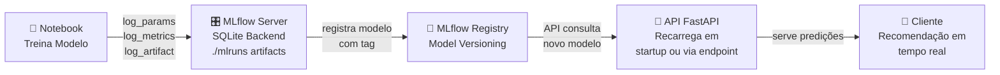
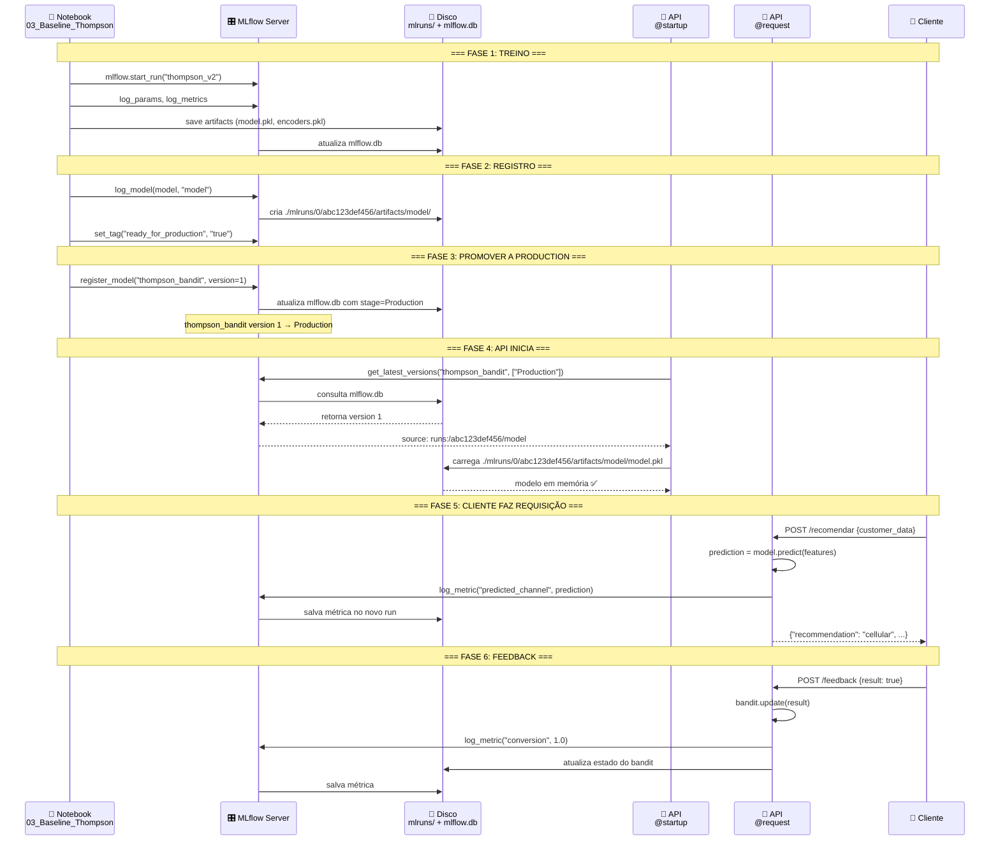

# 🚀 MLflow Workflow Prático: Do Notebook à Produção

## O Que Você Precisa Entender

Quando você treina um novo modelo no notebook, **aqui está o que acontece por trás dos bastidores:**



---

## Fluxo Passo a Passo (Na Prática)

### PASSO 1️⃣: Você roda o notebook `03_Baseline_e_Thompson.ipynb`

**O que você faz:**
```python
# Célula 1: Imports
import mlflow
import mlflow.sklearn

# Célula 2: Treinar Thompson Sampling
with mlflow.start_run(run_name="thompson_sampling_v2"):
    mlflow.log_param("alpha_prior", 1)
    mlflow.log_metric("auc", 0.79)
    mlflow.set_tag("ready_for_production", "true")
    mlflow.sklearn.log_model(model, "model")

# Você aperta SHIFT+ENTER para rodar
```

**O que MLflow faz automaticamente:**

```
1. Cria um novo RUN com ID único (ex: abc123def456)
   └─ Gera diretório: ./mlruns/0/abc123def456/

2. Salva PARÂMETROS
   └─ File: ./mlruns/0/abc123def456/params/alpha_prior → "1"

3. Salva MÉTRICAS
   └─ File: ./mlruns/0/abc123def456/metrics/auc → 0.79

4. Salva TAGS
   └─ File: ./mlruns/0/abc123def456/tags/ready_for_production → "true"

5. Salva MODELO
   └─ Directory: ./mlruns/0/abc123def456/artifacts/model/
      ├─ model.pkl (serializado)
      ├─ MLmodel (metadados)
      └─ requirements.txt (dependências)

6. Registra no BACKEND (SQLite)
   └─ mlflow.db agora tem entrada nova com run_id, params, metrics, tags
```

**Estado do disco após rodar a célula:**

```bash
datathon-8mlet-grupo-04/
├── mlruns/
│   └── 0/  # Experiment ID
│       ├── abc123def456/  # ← NOVO RUN
│       │   ├── params/
│       │   │   ├── alpha_prior
│       │   │   └── beta_prior
│       │   ├── metrics/
│       │   │   ├── auc
│       │   │   ├── conversion_rate
│       │   │   └── improvement_vs_baseline_pct
│       │   ├── tags/
│       │   │   ├── ready_for_production
│       │   │   ├── best_model
│       │   │   └── version
│       │   └── artifacts/
│       │       └── model/
│       │           ├── model.pkl  ← MODELO SERIALIZADO
│       │           ├── MLmodel    ← Metadados
│       │           └── requirements.txt
│       └── (outros runs antigos...)
└── mlflow.db  # ← ATUALIZADO com novo run
```

---

### PASSO 2️⃣: Você abre MLflow UI

**Comando:**
```bash
# Terminal
mlflow server --backend-store-uri sqlite:///mlflow.db \
              --default-artifact-root ./mlruns \
              --host 0.0.0.0 --port 5000
```

**URL:**
```
http://localhost:5000
ou
http://localhost:5002 (se via Docker Compose)
```

**O que você vê:**

```
┌──────────────────────────────────────────────────────────────┐
│  EXPERIMENTS                                                 │
├──────────────────────────────────────────────────────────────┤
│                                                              │
│  Experiment: Default (ID: 0)                                 │
│  ┌────────────────────────────────────────────────────────┐ │
│  │ Run Name: thompson_sampling_v2   [abc123def456]        │ │
│  │ Status: FINISHED                                        │ │
│  │ Start: 2026-09-20 15:42:30                             │ │
│  │ Duration: 1m 23s                                        │ │
│  │                                                         │ │
│  │ PARÂMETROS                     │ MÉTRICAS              │ │
│  │ ├─ alpha_prior: 1              │ ├─ auc: 0.79         │ │
│  │ ├─ beta_prior: 1               │ ├─ conversion: 19.7% │ │
│  │ └─ seed: 42                    │ └─ improvement: +31%  │ │
│  │                                                         │ │
│  │ TAGS                            ARTIFACTS              │ │
│  │ ├─ ready_for_production: true   ├─ model/             │ │
│  │ ├─ best_model: true             ├─ scaler.pkl         │ │
│  │ └─ version: v1.0                └─ encoders.pkl       │ │
│  └────────────────────────────────────────────────────────┘ │
│                                                              │
└──────────────────────────────────────────────────────────────┘
```

---

### PASSO 3️⃣: Você marca o modelo como "production"

**Na MLflow UI:**

1. Clica em "Register Model" (botão azul no topo)
2. Dá um nome: ex. `thompson_bandit`
3. Clica "Register"

**O que MLflow faz:**

```
MLflow cria um "Model Stage" com versões:
├── thompson_bandit/
│   ├── version: 1 (seu primeiro registro)
│   │   ├── stage: "Staging" (padrão)
│   │   └── run_id: abc123def456
│   ├── version: 2 (versão anterior)
│   │   ├── stage: "Production"
│   │   └── run_id: xyz789abc123
│   └── version: 3 (mais recente, ainda em teste)
│       ├── stage: "None"
│       └── run_id: def456xyz789
```

2. Clica em "thompson_bandit version 1"
3. Muda o stage de "Staging" → "Production" (dropdown)

**Resultado:**

```
✅ thompson_bandit versão 1 está em "Production"
   └─ Tag adicionada automaticamente: stage=Production
```

**Arquivo criado no disco:**

```bash
mlruns/
├── models/  # ← NOVO (Model Registry)
│   └── thompson_bandit/
│       ├── version 1/
│       │   └── metadata.yaml
│       │       ├── name: thompson_bandit
│       │       ├── version: 1
│       │       ├── stage: Production
│       │       └── source: runs:/abc123def456/model
│       └── version 2/
│           └── metadata.yaml
│               ├── name: thompson_bandit
│               ├── version: 2
│               ├── stage: Production (antigo)
│               └── source: runs:/xyz789abc123/model
```

---

### PASSO 4️⃣: API carrega o modelo automaticamente

**Arquivo: `app/main.py`**

```python
from mlflow.tracking import MlflowClient
import mlflow.sklearn

model = None
model_version = None

@app.on_event("startup")
async def load_model():
    """
    Executado quando API inicia.
    Carrega AUTOMATICAMENTE o modelo em stage "Production"
    """
    global model, model_version
    
    # Conectar ao MLflow
    client = MlflowClient(tracking_uri="http://localhost:5000")
    
    # Procurar modelo em Production
    model_versions = client.get_latest_versions(
        name="thompson_bandit",
        stages=["Production"]
    )
    
    if model_versions:
        # Pegar a versão em Production
        prod_version = model_versions[0]
        
        # Carregar modelo
        model_uri = f"models:/thompson_bandit/Production"
        model = mlflow.sklearn.load_model(model_uri)
        model_version = prod_version.version
        
        print(f"✅ Modelo carregado!")
        print(f"   Nome: thompson_bandit")
        print(f"   Versão: {model_version}")
        print(f"   Stage: Production")
    else:
        print("⚠️ Nenhum modelo em Production encontrado!")
```

**O que acontece quando você inicia a API:**

```bash
$ python app/main.py
# ou
$ uvicorn app.main:app --reload

[STARTUP]
✅ Modelo carregado!
   Nome: thompson_bandit
   Versão: 1
   Stage: Production
   
[INFO] MLflow Backend: http://localhost:5000
[INFO] API iniciada em: http://localhost:8000
```

**MLflow faz:**

```
1. Consulta o banco de dados (mlflow.db)
   └─ "Qual é o modelo em Production?"

2. Encontra: thompson_bandit version 1
   └─ source: runs:/abc123def456/model

3. Carrega o modelo do disco
   └─ De: ./mlruns/0/abc123def456/artifacts/model/
   └─ Para: memória da API

4. Também carrega parâmetros salvos
   └─ scaler.pkl, encoders.pkl, etc
```

---

### PASSO 5️⃣: API usa o modelo para fazer predições

**Requisição do cliente:**

```bash
curl -X POST http://localhost:8000/recomendar \
  -H "Content-Type: application/json" \
  -d '{
    "customer_id": "C12345",
    "age": 35,
    "balance": 5000,
    "previous_campaigns": 2,
    ...
  }'
```

**O que acontece dentro da API:**

```python
@app.post("/recomendar")
async def recomendar(customer_data: dict):
    # 1. Extrair features do input
    features = extract_features(customer_data)
    
    # 2. Usar MODELO EM MEMÓRIA para prever
    prediction = model.predict([features])[0]
    
    # 3. LOG NO MLFLOW (para monitoramento!)
    with mlflow.start_run(run_name="production_inference"):
        mlflow.log_param("model_version", model_version)
        mlflow.log_param("customer_id", customer_data["customer_id"])
        mlflow.log_metric("predicted_channel", 1 if prediction == "cellular" else 0)
        mlflow.log_metric("confidence", confidence_score)
    
    # 4. Retornar resultado
    return {
        "recommendation": prediction,
        "confidence": confidence_score,
        "model_version": model_version
    }
```

**Resposta:**

```json
{
  "customer_id": "C12345",
  "recommendation": "cellular",
  "confidence": 0.78,
  "model_version": 1
}
```

**O que foi salvo no MLflow:**

```
mlruns/
├── 0/
│   ├── abc123def456/ (run do treino)
│   │   └── artifacts/model/
│   │
│   └── (novo run da predição)
│       ├── params/
│       │   ├── model_version → "1"
│       │   └── customer_id → "C12345"
│       ├── metrics/
│       │   ├── predicted_channel → "1"
│       │   └── confidence → "0.78"
│       └── artifacts/
│           └── (empty, só os logs importam)
```

---

### PASSO 6️⃣: Cliente envia feedback

**Requisição:**

```bash
# Após a ligação, você sabe se conversou ou não
curl -X POST http://localhost:8000/feedback \
  -H "Content-Type: application/json" \
  -d '{
    "decision_id": "DECISION_12345",
    "actual_result": true  # conversão bem-sucedida!
  }'
```

**O que API faz:**

```python
@app.post("/feedback")
async def feedback(decision_id: str, actual_result: bool):
    # 1. Thompson Sampling aprende!
    bandit.update(decision_id, actual_result)
    
    # 2. Log no MLflow
    with mlflow.start_run(run_name="production_feedback"):
        mlflow.log_metric("conversion", 1 if actual_result else 0)
        
        # Logar estatísticas dos braços
        stats = bandit.get_stats()
        mlflow.log_metric("cellular_conversions", stats["cellular"]["wins"])
        mlflow.log_metric("telephone_conversions", stats["telephone"]["wins"])
    
    # 3. Atualizar estado persistido
    update_bandit_state()
    
    return {"status": "ok"}
```

**MLflow registra:**

```
Novo run criado: production_feedback_xxxxx
├── metrics/
│   ├── conversion → 1.0
│   ├── cellular_conversions → 45
│   ├── telephone_conversions → 38
│   └── timestamp → 2026-09-20 15:45:30
```

---

## Fluxo Completo em Diagrama



---

## Timeline Real: Quanto Tempo Leva?

### Treino (Notebook)

```
Evento                          Tempo        Cumulativo
─────────────────────────────────────────────────────
Carregar dados                  2s           2s
Preparar features               1s           3s
Treinar baseline                3s           6s
└─ MLflow log                   0.1s         6.1s
Treinar Thompson (50 épocas)    15s          21s
└─ MLflow log params/metrics    0.2s         21.2s
└─ MLflow log artifacts         1s           22.2s
Registrar modelo em MLflow      0.5s         22.7s
─────────────────────────────────────────────────────
TOTAL                           ~23s
```

### API Startup

```
Evento                          Tempo        Cumulativo
─────────────────────────────────────────────────────
Inicializar FastAPI             0.5s         0.5s
Conectar ao MLflow              0.2s         0.7s
Consultar modelo em Production  0.1s         0.8s
Carregar modelo em memória      0.5s         1.3s
─────────────────────────────────────────────────────
TOTAL                           ~1.3s
```

### Requisição (/recomendar)

```
Evento                          Tempo
──────────────────────────────────────
Validar input                   1ms
Extrair features                2ms
Prever (em memória)             5ms
Log no MLflow                   10ms
─────────────────────────────────────
TOTAL                           ~18ms (55 req/sec)
```

---

## Checklist Prático: Seu Primeiro Deploy

### ✅ Local Development

```bash
# 1. Terminal 1: Iniciar MLflow
cd datathon-8mlet-grupo-04
mlflow server --backend-store-uri sqlite:///mlflow.db \
              --default-artifact-root ./mlruns \
              --host 0.0.0.0 --port 5000

# 2. Verificar MLflow UI
# Abrir browser: http://localhost:5000

# 3. Terminal 2: Executar notebook
jupyter notebook notebooks/03_Baseline_e_Thompson.ipynb

# 4. Rodar células (SHIFT+ENTER)
# - Célula com mlflow.start_run("thompson_v2")
# - Célula com mlflow.log_metric(...)
# - Célula com mlflow.sklearn.log_model(...)

# 5. Voltar para MLflow UI
# - Refresh página
# - Deve ver novo run "thompson_v2"
# - Clicar em "Register Model"
# - Dar nome: "thompson_bandit"
# - Clicar "Register"

# 6. Promover para Production
# - Clicar em "thompson_bandit" (agora existe!)
# - Ir para version 1
# - Stage dropdown: "None" → "Production"
# - Clicar "Update"

# 7. Terminal 3: Iniciar API
cd datathon-8mlet-grupo-04/app
uvicorn main:app --reload --port 8000

# 8. Testar API
curl http://localhost:8000/health

# Deve ver:
# {
#   "status": "healthy",
#   "model_version": 1,
#   "mlflow_uri": "http://localhost:5000"
# }

# 9. Fazer predição
curl -X POST http://localhost:8000/recomendar \
  -H "Content-Type: application/json" \
  -d '{"customer_id": "C123", "age": 35, "balance": 5000}'

# 10. Voltar para MLflow UI
# - Novo run "production_inference" deve estar visível
# - Métricas de predição logadas
```

### ✅ Com Docker Compose

```bash
# 1. Iniciar tudo junto
docker compose -f deploy/docker-compose.yml up -d

# 2. Verificar containers rodando
docker compose -f deploy/docker-compose.yml ps
# Deve listar: mlflow, fastapi, postgres (se houver)

# 3. MLflow UI
# http://localhost:5002  (remapeado de 5000)

# 4. API
# http://localhost:8000/docs (Swagger)

# 5. Logs em tempo real
docker compose -f deploy/docker-compose.yml logs -f mlflow

# 6. Executar notebook (de fora do container)
jupyter notebook notebooks/03_Baseline_e_Thompson.ipynb
# Vai conectar no MLflow do Docker (localhost:5002)

# 7. Parar
docker compose -f deploy/docker-compose.yml down
```

---

## Troubleshooting

### ❌ "Nenhum modelo em Production encontrado!"

**Problema:** API iniciou mas não carregou modelo.

**Solução:**
```bash
# 1. Verificar se MLflow está rodando
ps aux | grep mlflow
# Ou
docker ps | grep mlflow

# 2. Verificar se modelo foi registrado
curl http://localhost:5000/api/2.0/registered-models
# Deve ter "thompson_bandit"

# 3. Verificar stage do modelo
curl http://localhost:5000/api/2.0/registered-models/thompson_bandit
# Deve ter "stage": "Production"

# 4. Se nada disso ajudar, registrar manual:
# - Abrir http://localhost:5000/
# - Procurar run thompson_v2
# - Clicar "Register Model"
# - Depois ir em "Manage" → stage = Production
```

### ❌ "ConnectionError: Failed to connect to MLflow"

**Problema:** API não consegue conectar no MLflow.

**Solução:**
```python
# Em app/main.py, verificar:
mlflow_client = MlflowClient(tracking_uri="http://localhost:5000")
#                                         ↑ correto?

# Se em Docker Compose:
mlflow_client = MlflowClient(tracking_uri="http://mlflow:5000")
#                                         ↑ nome do container
```

### ❌ "Model not found in registry"

**Problema:** Registrou modelo mas API não encontra.

**Solução:**
```bash
# Listar modelos registrados
mlflow models list

# Ou via API
curl http://localhost:5000/api/2.0/registered-models

# Se vazio, fazer manual:
# 1. No notebook, adicionar:
mlflow.register_model(
    model_uri="runs:/abc123def456/model",
    name="thompson_bandit"
)

# 2. Depois promover para Production:
from mlflow.tracking import MlflowClient
client = MlflowClient()
client.transition_model_version_stage(
    name="thompson_bandit",
    version=1,
    stage="Production"
)
```

---

## Resumo do Fluxo

| Etapa | O Que Você Faz | O Que MLflow Faz | Resultado |
|-------|---|---|---|
| 1 | Roda notebook com `mlflow.start_run()` | Cria run, salva params/metrics/artifacts | Modelo em `./mlruns/` |
| 2 | Clica "Register Model" na UI | Cria entrada no Model Registry | Modelo registrado |
| 3 | Muda stage para "Production" | Atualiza `mlflow.db` | Marca como produção |
| 4 | Inicia API | API consulta MLflow por modelo em Production | Modelo carregado em memória |
| 5 | Cliente faz requisição | API usa modelo em memória | Predição em <20ms |
| 6 | Feedback enviado | MLflow loga métrica | Histórico de performance |

**Conclusão:** MLflow **automatiza todo o pipeline** de experimental tracking → model registry → deployment → monitoring. Você só precisa:
1. Treinar no notebook (com `mlflow.start_run()`)
2. Registrar o modelo (1 clique na UI)
3. Promover para Production (1 mudança de dropdown)
4. API recarrega automaticamente! ✅

---

**Criado para:** datathon-8mlet-grupo-04  
**Data:** 2026-09-20  
**Próximo:** Implementar no seu projeto!
